# REPORT.md — Mini-SOAR: Automated Threat Detection & Response on AWS

## Abstract

This project implements a functional Security Orchestration, Automation and Response (SOAR) pipeline entirely on AWS infrastructure, integrating open-source security tools (Wazuh, TheHive) with a workflow automation engine (n8n) and a third-party threat intelligence service (VirusTotal). The system detects suspicious activity on a monitored Windows endpoint, enriches the alert with external threat data, creates a documented incident case, requests human approval via email, and — upon approval — automatically executes a containment action while logging the outcome. The result mirrors the detect → investigate → approve → respond workflow used in production Security Operations Centers (SOCs).

---

## 1. Objectives

- Build a working detection pipeline using an industry-standard SIEM/EDR tool (Wazuh)
- Integrate automated threat intelligence enrichment (VirusTotal)
- Implement formal incident case management (TheHive), reflecting real SOC documentation practices
- Design a human-in-the-loop approval mechanism, rather than fully autonomous response
- Automate the containment action (IP blocking) and close the audit loop by recording the outcome back into the case
- Deploy the entire stack on cloud infrastructure (AWS) rather than a local lab, to reflect a more production-realistic environment

---

## 2. Architecture

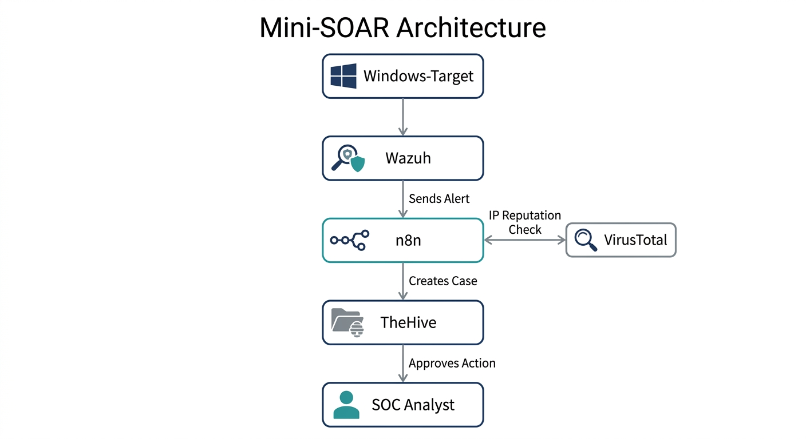

**Components:**

| Component | Purpose | Host |
|---|---|---|
| Wazuh Manager + Indexer + Dashboard | Detection engine (SIEM/EDR) | SOC-Automation (EC2) |
| Wazuh Agent + Sysmon | Endpoint telemetry | Windows-Target (EC2) |
| TheHive + Cassandra + Elasticsearch | Case management | SOC-Automation (EC2) |
| n8n | Workflow orchestration | SOC-Automation (EC2) |
| VirusTotal | Threat intelligence (external API) | Cloud service |

**Data flow:**

1. Wazuh agent (with Sysmon) monitors Windows-Target and forwards events to the Wazuh Manager
2. Wazuh's rule engine evaluates events and generates alerts; alerts at severity level 7+ are forwarded via webhook to n8n
3. n8n enriches the source IP via VirusTotal's reputation API
4. n8n creates a case in TheHive containing the alert details and enrichment result
5. n8n emails the analyst an approval request containing the alert summary, IP reputation, and a link to the full case
6. The analyst approves or declines directly from the email
7. On approval, n8n authenticates against Wazuh's REST API and triggers an active-response command to block the offending IP on Windows-Target
8. n8n writes the outcome (blocked or declined) back to the TheHive case as a comment, closing the audit trail

---

## 3. Implementation Summary

### 3.1 Detection Layer

Wazuh was deployed via Docker on an EC2 instance, with a Windows Server 2022 agent enrolled over the private network. Sysmon was installed using the SwiftOnSecurity configuration to significantly increase detection fidelity (process creation, network connections, file drops) beyond Wazuh's default Windows Event Log coverage.

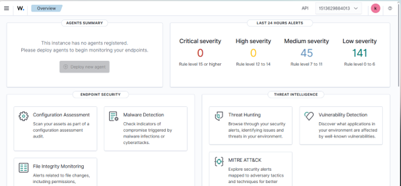
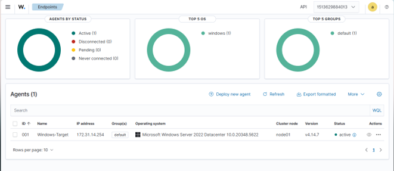
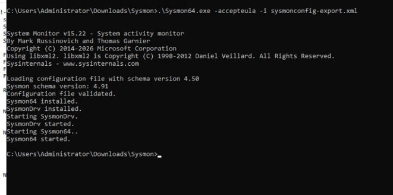

### 3.2 Orchestration Layer

n8n was selected over alternatives such as Shuffle primarily on resource grounds — Shuffle's dependency on an internal OpenSearch instance made it unsuitable for a memory-constrained (8GB) host already running Wazuh and TheHive. n8n's lighter footprint, along with a built-in "Send and Wait for Response" email node (used for the approval step) and native HTTP Request nodes, made it sufficient for the full pipeline without additional infrastructure.

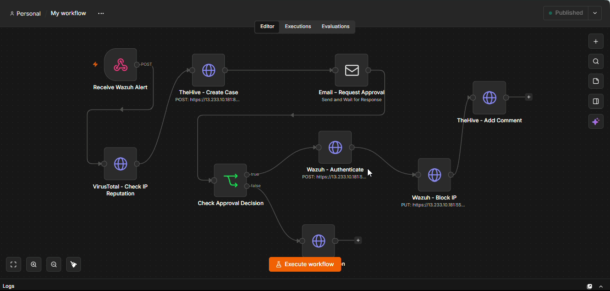
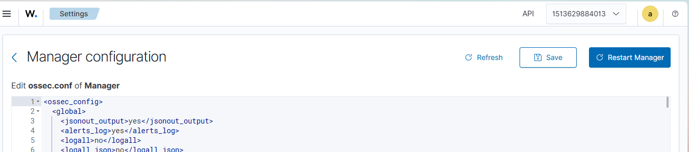

### 3.3 Case Management Layer

TheHive was deployed using its officially maintained Docker profile, with default resource allocations (CPU limits, JVM heap sizes) reduced to fit the available 2-vCPU/8GB host. A dedicated organisation and service account were created specifically for automated case creation, since TheHive's default administrative organisation is intentionally restricted from case-management operations.

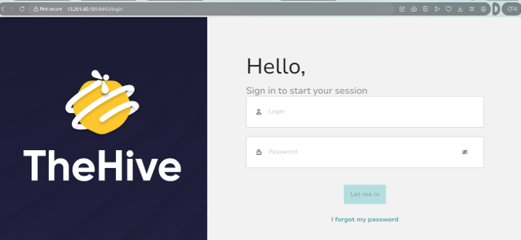

### 3.4 Response Layer

Response actions use Wazuh's built-in Active Response framework rather than custom scripting — specifically the pre-defined `win_route-null` command, triggered via Wazuh's REST API after a JWT-based authentication step. This avoided introducing custom agent-side scripts and relied on Wazuh's supported response mechanism.

### 3.5 Human Approval Layer

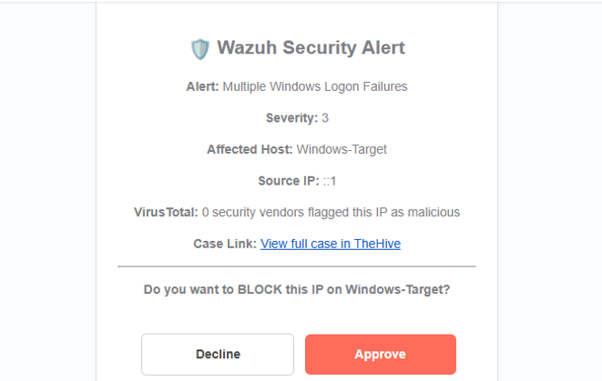

The approval email includes the alert title, severity, affected host, source IP, VirusTotal's malicious-detection count, and a direct link to the corresponding TheHive case — giving the analyst sufficient context to make an informed decision without needing to switch tools first.

---

## 4. Testing & Results

Testing was performed by triggering controlled authentication failures against Windows-Target and observing the full pipeline execute without manual intervention beyond the approval decision itself.

**Confirmed working:**
- Real-time alert generation from both native Windows Security events and Sysmon
- Successful webhook delivery from Wazuh to n8n
- Successful VirusTotal API enrichment
- Successful case creation in TheHive with accurate alert data and enrichment results
- Successful email delivery with working Approve/Decline actions
- Successful Wazuh Active Response execution on approval, confirmed via API response (`"message": "AR command was sent to all agents"`)
- Successful audit logging — the case is automatically updated with the outcome of the analyst's decision

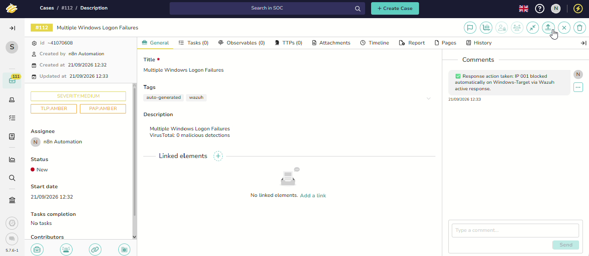
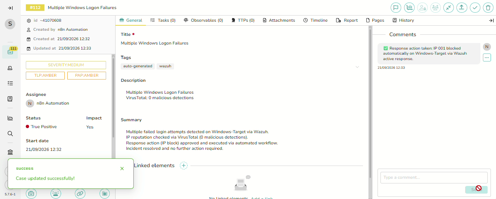

**Security group configuration** (final state, all services accessible only on required ports):

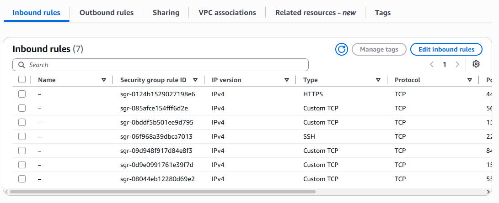

---

## 5. Challenges & Lessons Learned

| Challenge | Resolution |
|---|---|
| TheHive's default resource requirements (CPU/RAM) significantly exceeded the host's capacity | Manually reduced CPU allocation and JVM heap sizes across Cassandra, Elasticsearch, and TheHive |
| Port conflict between Wazuh's dashboard and TheHive's reverse proxy (both defaulting to 443) | Reassigned TheHive's Nginx to port 8443 |
| n8n rejected TheHive and Wazuh's self-signed TLS certificates | Enabled "Ignore SSL Issues" on relevant HTTP Request nodes; for the Wazuh webhook specifically, reverted n8n to plain HTTP internally, since Wazuh's `wazuh-integratord` performs stricter certificate validation than a browser |
| TheHive's default "admin" organisation cannot create or manage cases | Created a dedicated organisation with a scoped-permission service account for automation use |
| Wazuh's alert JSON structure places the source IP in different fields depending on alert type, nested under an `all_fields` object not immediately obvious from the dashboard preview | Inspected raw alert data directly via `alerts.json` on the manager to identify correct field paths (`eventdata.ipAddress` for authentication events, `eventdata.sourceIp` for Sysmon network events) |
| AWS assigns a new public IP to EC2 instances on every stop/start cycle | Documented as an operational limitation; addressed by updating Wazuh's webhook URL, n8n's `WEBHOOK_URL` environment variable, and all hardcoded API endpoints after each restart (see `how_to_set.md`) |
| VirusTotal API returned "User is inactive" despite a valid key | Root cause was an unconfirmed account email; resolved by completing email verification |

---

## 6. Limitations

- **Source IP data in testing:** because test attacks were generated by connecting to Windows-Target from itself (via RDP/local PowerShell), the source IP recorded is the loopback address (`::1`) rather than an external address. The extraction and enrichment logic is verified correct; a genuine external attack would populate a real public IP in the same fields.
- **Public IP volatility:** since the environment uses standard (non-Elastic) EC2 public IPs, the pipeline requires manual reconfiguration after any instance restart. In a production deployment, this would be resolved with an Elastic IP or a DNS-based endpoint.
- **Single-agent scope:** the pipeline currently monitors one Windows endpoint. Scaling to multiple endpoints would require no architectural changes, only additional agent enrollment.

---

## 7. Conclusion

This project successfully demonstrates a complete, functioning SOAR pipeline built entirely from open-source and free-tier cloud-hosted tools. It replicates the core operational pattern of a real SOC — automated detection and enrichment paired with mandatory human authorization before any response action — while maintaining a full, self-documenting audit trail within TheHive. Beyond the working system itself, the debugging process (resource tuning, certificate handling, API field discovery, and infrastructure quirks around dynamic IP addressing) reflects practical, production-relevant troubleshooting experience applicable well beyond this specific stack.

---

## Appendix: Related Documentation

- [`how_to_set.md`](how_to_set.md) — full step-by-step build instructions with exact commands
- [`README.md`](README.md) — project overview