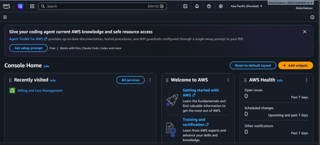

Complete build guide


---

## Phase 1: AWS Account Setup

1. Go to `aws.amazon.com` → Create an AWS account
2. Enter email, account name, verify email with the code sent
3. Set root password, enter contact info, enter payment info (required for identity verification, not charged unless you exceed the free credit)
4. Verify phone number
5. Choose the **Free Plan** 
6. Switch region (top-right dropdown) to one near you for lower latency




## Phase 2: Launch SOC-Automation (Linux server)

1. EC2 → Instances → Launch instance
2. Name: `SOC-Automation`
3. AMI: **Ubuntu Server 24.04 LTS**, 64-bit (x86)
4. Instance type: `m7i-flex.large` (2 vCPU, 8GB RAM) — biggest allowed on Free Plan
5. Key pair: Create new → RSA → .pem format → download and save it
6. Storage: change from 8 GiB to **30 GiB** (later resized to 60GB — see Phase 9)
7. Security group: leave defaults, add ports as needed later
8. Launch instance
9. Connect via **EC2 Instance Connect** (browser SSH)

---

## Phase 3: Install Docker on SOC-Automation

```bash
sudo apt update && sudo apt upgrade -y
sudo apt install -y docker.io docker-compose
docker --version
docker compose version
sudo usermod -aG docker $USER
exit
```
Reconnect after exiting (group change requires a fresh session).

---

## Phase 4: Install Wazuh

```bash
git clone https://github.com/wazuh/wazuh-docker.git -b v4.14.7
cd wazuh-docker/single-node
sudo sysctl -w vm.max_map_count=262144
sudo docker compose -f generate-indexer-certs.yml run --rm generator
docker compose up -d
docker ps
```

**Open in Security Group:** HTTPS, Port 443, Source Anywhere-IPv4 (dashboard access)

**Access:** `https://<Public IP>` — default login `admin` / `admin`, change password immediately.

**Get the API password** (needed later for n8n):
```bash
grep API_PASSWORD ~/wazuh-docker/single-node/docker-compose.yml
```


---

## Phase 5: Launch Windows-Target

1. EC2 → Launch instance → Name: `Windows-Target`
2. AMI: **Microsoft Windows Server 2022 Base**
3. Instance type: `c7i-flex.large` (2 vCPU, 4GB RAM)
4. Key pair: new RSA + .pem, named `Windows-Target-key`
5. Storage: 40 GiB
6. Launch

**Connecting:** if the standard Remote Desktop app isn't available on your host, use AWS's browser method instead:
1. Enable it once: Systems Manager → Settings → **Enable DHMC** (Default Host Management Configuration)
2. Reboot the Windows-Target instance (needed to pick up the new permission)
3. EC2 → select instance → Connect → **"In web browser"** tab → **Fleet Manager Remote Desktop**
4. Get the Administrator password: Connect → RDP client tab → Get password → upload your `.pem` key → decrypt
5. Click **Connect with Fleet Manager Remote Desktop**, enter username `Administrator` + decrypted password

---

## Phase 6: Install Wazuh Agent on Windows-Target

1. Wazuh dashboard → Endpoints → **Deploy new agent**
2. OS: MSI (Windows)
3. Server address: SOC-Automation's **private IP** (not public — more reliable, internal AWS network)
4. Agent name: `Windows-Target`
5. Copy the generated PowerShell command, run it as Administrator inside Windows-Target
6. Start the service: `NET START WazuhSvc`

**Open in Security Group (on SOC-Automation):** Custom TCP ports 1514 and 1515, Source: your VPC CIDR (e.g. `172.31.0.0/16`)

**Verify:** Wazuh dashboard → Endpoints — Windows-Target should show status **"active"**


---

## Phase 7: Install Sysmon on Windows-Target

1. Download from Microsoft Sysinternals: `https://learn.microsoft.com/en-us/sysinternals/downloads/sysmon`
2. Download the config: `https://raw.githubusercontent.com/SwiftOnSecurity/sysmon-config/master/sysmonconfig-export.xml` — save in the same folder
3. In PowerShell (Admin), inside that folder:
```powershell
.\Sysmon64.exe -accepteula -i sysmonconfig-export.xml
```


**Tell Wazuh to read Sysmon's logs** — Wazuh dashboard → Agents management → Groups → `default` → Edit group configuration:
```xml
<agent_config>
  <localfile>
    <location>Microsoft-Windows-Sysmon/Operational</location>
    <log_format>eventchannel</log_format>
  </localfile>
</agent_config>
```
Save, then restart the agent on Windows-Target:
```powershell
NET STOP WazuhSvc
NET START WazuhSvc
```

---

## Phase 8: Install TheHive

```bash
cd ~
git clone https://github.com/StrangeBeeCorp/docker.git thehive-docker
cd thehive-docker/prod1-thehive
bash ./scripts/init.sh
```
Type `y` to fix permissions, enter your server's Public IP when asked for the hostname.

**Before starting, tune resources for a small server:**

1. Lower CPU limits in `docker-compose.yml` (defaults assume more vCPUs than available):
```bash
sed -i "s/cpus: '3.000'/cpus: '0.8'/g; s/cpus: '4.000'/cpus: '0.8'/g; s/cpus: '1.000'/cpus: '0.4'/g" docker-compose.yml
```
2. Lower memory: edit `MAX_HEAP_SIZE`, `HEAP_NEWSIZE`, `ES_JAVA_OPTS`, and JVM heap values down (e.g. Cassandra to 1G/256M, Elasticsearch to 1G, TheHive to 512M), and memory limits to ~1-1.5G each
3. Move Nginx off port 443 (already used by Wazuh):
```bash
sed -i "s/'443:443'/'8443:443'/" docker-compose.yml
```
4. Fix Elasticsearch SSL mismatch — edit `thehive/config/index.conf`, add this line inside the `db.janusgraph.index.search` block, above `elasticsearch.http.auth`:
```
elasticsearch.ssl.enabled = false
```

```bash
docker compose up -d
```
(If Elasticsearch shows unhealthy on first try, just run `docker compose up -d` again — it usually just needed more startup time.)

**Open in Security Group:** Custom TCP, Port 8443, Source Anywhere-IPv4

**Access:** `https://<Public IP>:8443` — default login `admin@thehive.local` / `secret`, change password immediately.


**Create a working organisation** (the default "admin" org can't manage cases):
1. Organisation List → Create new org → name it `SOC`
2. Add a user: Type = **Service**, Login = `n8n-automation@gmail.com`, Profile = custom permissions: `manageCase/create`, `manageCase/update`, `manageAlert/create`
3. Open that user → generate an **API Key**, save it

---

## Phase 9: Fix disk space (if you hit "no space left on device")

```bash
docker image prune -a -f
```
If still full, resize the actual EBS volume:
1. EC2 → Volumes → select the volume → Actions → Modify Volume → increase size (e.g. 30 → 60 GiB)
2. On the server:
```bash
lsblk
sudo growpart /dev/nvme0n1 1
sudo resize2fs /dev/nvme0n1p1
df -h
```

**Open in Security Group (final list needed across all services):**


---

## Phase 10: Install n8n

```bash
docker run -d --name n8n --restart unless-stopped -p 5678:5678 \
  -e N8N_SECURE_COOKIE=false \
  -e WEBHOOK_URL=http://<Public IP>:5678/ \
  -v n8n_data:/home/node/.n8n \
  docker.n8n.io/n8nio/n8n
```

**Open in Security Group:** Custom TCP, Port 5678, Source Anywhere-IPv4

**Access:** `http://<Public IP>:5678` — set up an owner account on first visit.

**If you forget the n8n password:**
```bash
docker exec -it n8n n8n user-management:reset
```
(the workflow survives this reset)

---

## Phase 11: Build the n8n Workflow


### 11a. Trigger node
- Add **Webhook** node → Method: POST → Publish the workflow to activate it
- Copy the **Production URL** (not Test URL)

### 11b. Wazuh → n8n integration
Wazuh dashboard → Settings → Edit configuration → add inside `<ossec_config>`:
```xml
<integration>
  <name>shuffle</name>
  <hook_url>http://<Public IP>:5678/webhook/<webhook-id></hook_url>
  <level>7</level>
  <alert_format>json</alert_format>
</integration>
```
Save → Restart Manager.


### 11c. VirusTotal enrichment node
- Add HTTP Request node right after Webhook
- Method: GET
- URL: `https://www.virustotal.com/api/v3/ip_addresses/{{ $json.body.all_fields.data.win.eventdata.ipAddress || $json.body.all_fields.data.win.eventdata.sourceIp || '8.8.8.8' }}`
- Send Headers → `x-apikey: <your VirusTotal API key>`

(Requires a **verified** VirusTotal account — check email for the confirmation link, or the API returns "User is inactive")

### 11d. TheHive case creation node
- Add HTTP Request node after VirusTotal
- Method: POST
- URL: `https://<Public IP>:8443/api/v1/case`
- Authentication: Header Auth → `Authorization: Bearer <TheHive API key>`
- Send Body (JSON):
```json
{
  "title": "{{ $('Webhook').item.json.body.title }}",
  "description": "{{ $('Webhook').item.json.body.text || $('Webhook').item.json.body.title }}\n\nVirusTotal: {{ $('HTTP Request3').item.json.data.attributes.last_analysis_stats.malicious }} malicious detections",
  "severity": 2,
  "tlp": 2,
  "pap": 2,
  "tags": ["wazuh", "auto-generated"]
}
```
- Options → Ignore SSL Issues → enable

### 11e. Email approval node
- Add **Send Email** node → choose operation **"Send message and wait for response"**
- Credential: Gmail SMTP — `smtp.gmail.com`, port 465, SSL/TLS on, your Gmail address + a **Gmail App Password** (from `myaccount.google.com/apppasswords`)
- Response Type: Approval → Type of Approval: **Approve and Disapprove**
- Message (HTML):
```html
<h2>🛡️ Wazuh Security Alert</h2>
<p><b>Alert:</b> {{ $('Webhook').item.json.body.title }}</p>
<p><b>Severity:</b> {{ $('Webhook').item.json.body.severity }}</p>
<p><b>Affected Host:</b> {{ $('Webhook').item.json.body.all_fields.agent.name }}</p>
<p><b>Source IP:</b> {{ $('Webhook').item.json.body.all_fields.data.win.eventdata.ipAddress || $('Webhook').item.json.body.all_fields.data.win.eventdata.sourceIp || 'N/A' }}</p>
<p><b>VirusTotal:</b> {{ $('HTTP Request3').item.json.data.attributes.last_analysis_stats.malicious }} security vendors flagged this IP as malicious</p>
<p><b>Case Link:</b> <a href="https://<Public IP>:8443/cases/{{ $('HTTP Request').item.json._id }}/details">View full case in TheHive</a></p>
<hr>
<p><b>Do you want to BLOCK this IP on Windows-Target?</b></p>
```


### 11f. IF node (branch on decision)
- Add **IF** node after the email node
- Condition: `{{ $json.data.approved }}` is equal to `true` (Boolean, enable "Convert types where required")

### 11g. Approved branch — get Wazuh API token
- Add HTTP Request node on the **true** output
- Method: POST
- URL: `https://<Public IP>:55000/security/user/authenticate`
- Authentication: Basic Auth → `wazuh-wui` / `<API password>`
- Options → Ignore SSL Issues → enable

**Open in Security Group:** Custom TCP, Port 55000, Source your VPC CIDR

### 11h. Approved branch — block the IP
- Add HTTP Request node after the token node
- Method: PUT
- URL: `https://<Public IP>:55000/active-response?agents_list=001`
- Send Headers → `Authorization: Bearer {{ $('HTTP Request1').item.json.data.token }}`
- Send Body (JSON):
```json
{
  "command": "!win_route-null",
  "arguments": [],
  "alert": {
    "data": {
      "srcip": "{{ $('Webhook').item.json.body.all_fields.data.win.eventdata.ipAddress || $('Webhook').item.json.body.all_fields.data.win.eventdata.sourceIp || '' }}"
    }
  }
}
```
- Options → Ignore SSL Issues → enable

### 11i. Approved branch — log the outcome
- Add HTTP Request node after the block node
- Method: POST
- URL: `https://<Public IP>:8443/api/v1/case/{{ $('HTTP Request').item.json._id }}/comment`
- Authentication: same TheHive Header Auth credential
- Send Body (JSON):
```json
{
  "message": "✅ Response action taken: IP blocked automatically on Windows-Target via Wazuh active response."
}
```


### 11j. Declined branch — log the decision
- Add HTTP Request node on the IF node's **false** output
- Same setup as 11i, but body:
```json
{
  "message": "❌ Response action declined by analyst. No block was applied. Manual review recommended."
}
```

**Save and Publish** the whole workflow.

---

## Phase 12: Test End to End

On Windows-Target, PowerShell:
```powershell
net use \\localhost\ipc$ /user:Administrator WrongPassword123!
```
This triggers a clean "Logon Failure" alert without extra noise.

**Check in order:**
1. Wazuh → Threat Hunting → new alert appears
2. n8n → Executions → new run starts, reaches "Waiting"
3. Gmail → approval email arrives
4. Click **Approve**
5. TheHive → Cases → new case, with description + VirusTotal result
6. Case → Comments → auto-comment confirming the block
7. (Optional) Close the case → Resolution: **True Positive** → add a summary


---

## Ongoing Maintenance Note

Every time you **stop and restart** the EC2 instances, the public IP changes. After restarting, you must update:
1. Wazuh's `<hook_url>` (Settings → Edit configuration → Restart Manager)
2. n8n's `WEBHOOK_URL` (recreate the container with the new IP)
3. Every hardcoded IP inside the n8n workflow's HTTP Request nodes (TheHive, Wazuh auth, Wazuh block)