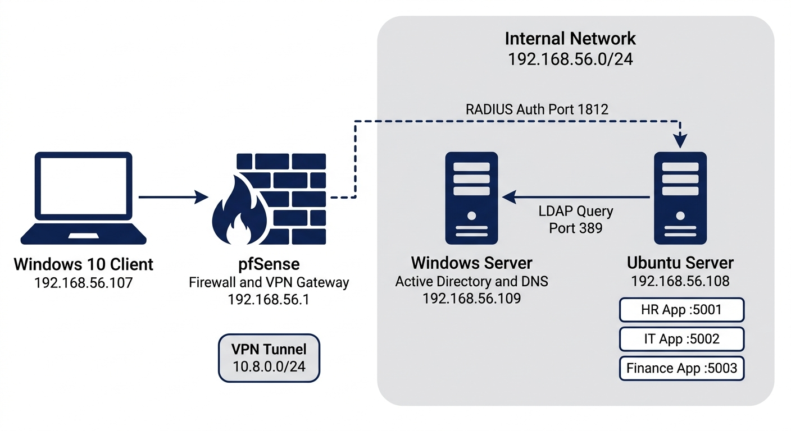
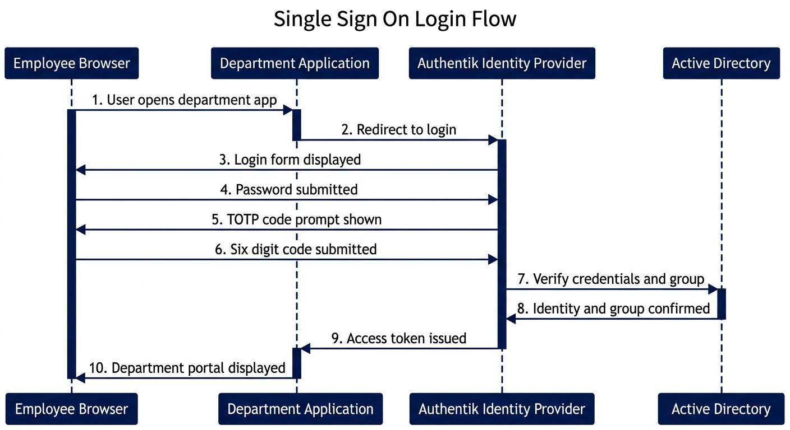
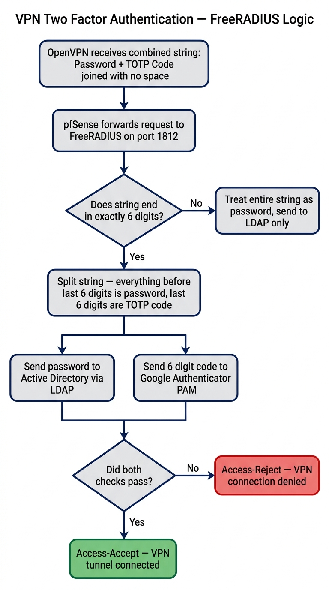
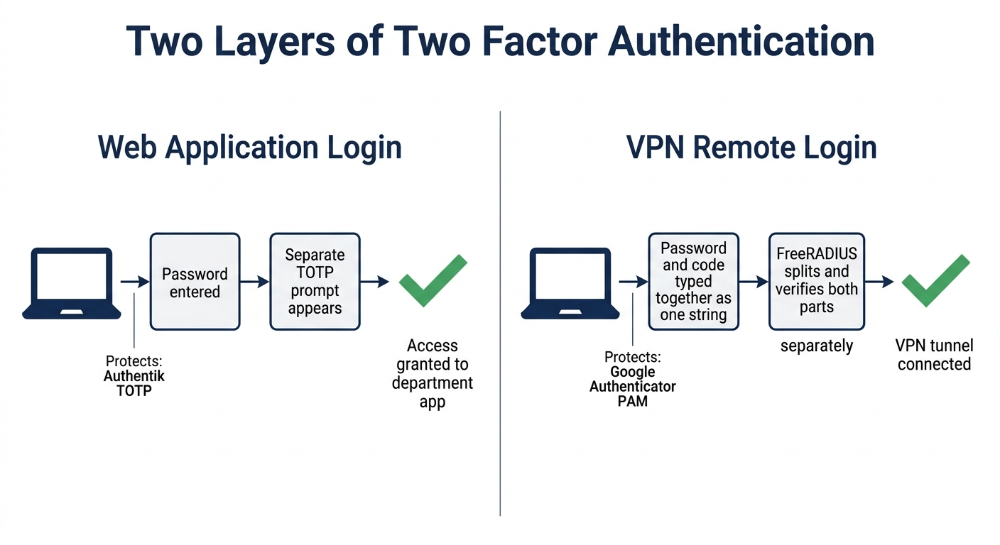
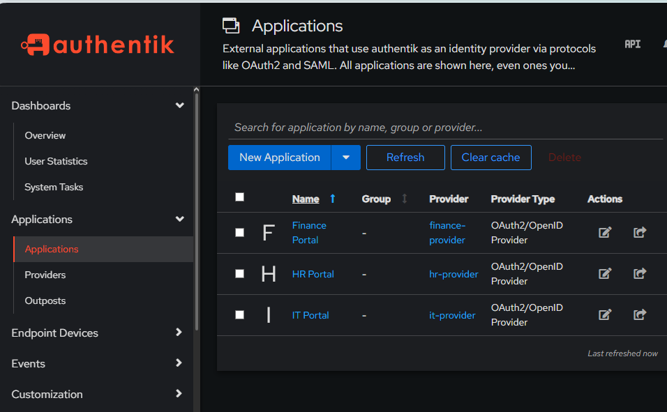
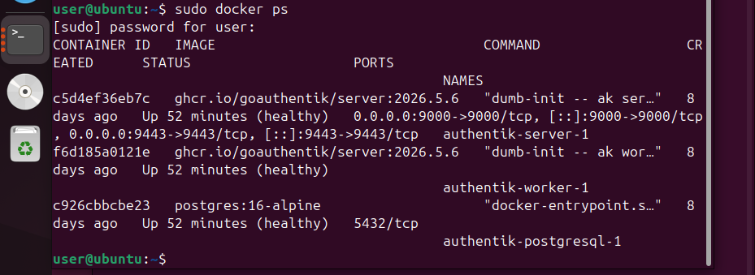
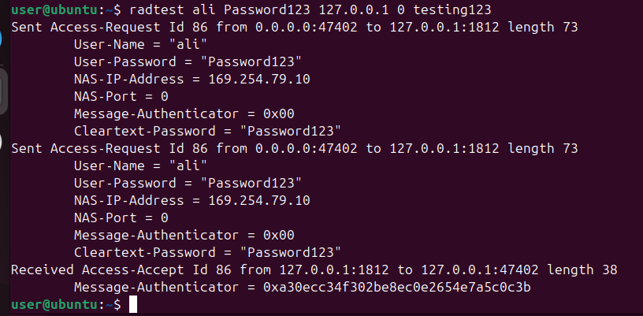

# 🔐 Enterprise Identity and Access Management Security Lab

### A complete simulation of centralized identity, single sign-on,
### role-based access control, and multi-layered VPN security.

---

---

## 📖 What This Project Is

This lab simulates a small company with three departments — HR, IT, and Finance.
Each department has one employee who can only access their own internal application.
Everything is controlled from one central identity source — Active Directory —
and protected by two completely separate layers of Two Factor Authentication.

This was not a tutorial follow-along. Every component was configured from scratch,
hit real failures, diagnosed through debug logs, and confirmed working end to end —
including VPN Two Factor Authentication which required solving version-specific
FreeRADIUS bugs that are not documented anywhere online.

---

## 🏗️ Architecture

| Machine | IP Address | Role |
|---|---|---|
| pfSense | 192.168.56.1 | Firewall and VPN gateway |
| Windows Server | 192.168.56.109 | Active Directory and DNS |
| Ubuntu Server | 192.168.56.108 | FreeRADIUS, Authentik, Flask apps |
| Windows 10 | 192.168.56.107 | Test client |

> All machines run on a private host-only network: `192.168.56.0/24`
> VPN tunnel uses a separate range: `10.8.0.0/24`

---

## 🧰 Tech Stack

| Tool | Category | Purpose |
|---|---|---|
| Active Directory | Identity Source | Single source of truth for all users and groups |
| Authentik | Identity Provider | Single Sign On and web login 2FA |
| Flask | Application | Three department web applications |
| pfSense | Network Security | Firewall and OpenVPN gateway |
| FreeRADIUS | Authentication | VPN credential verification |
| Google Authenticator PAM | 2FA | TOTP verification for VPN logins |
| Docker | Containerization | Runs Authentik in isolated containers |
| OAuth2 and OIDC | Protocol | Authentication between apps and Authentik |
| LDAP | Protocol | Directory queries against Active Directory |

---

## 👥 Company Structure

| Department | Employee | AD Group | Application | Port |
|---|---|---|---|---|
| HR | Ali | HR_Group | HR Portal | 5001 |
| IT | Ahmed | IT_Group | IT Portal | 5002 |
| Finance | Sara | Finance_GRoup | Finance Portal | 5003 |

> ⚠️ Note: Finance_GRoup has a capital R — this is the exact spelling in Active Directory
> and must match everywhere including Authentik policy bindings.

---

## 🔄 How It Works

### Web Login Flow

1. Employee opens their department app in a browser
2. App redirects to Authentik login page
3. Employee enters their AD password
4. Authentik prompts for a six digit TOTP code
5. Authentik checks Active Directory for identity and group membership
6. If the employee belongs to the correct department group — access granted
7. If not — access denied, even with correct credentials

---

### VPN Remote Access Flow

1. Remote employee opens OpenVPN
2. Types password immediately followed by six digit TOTP code — no space
3. pfSense forwards the request to FreeRADIUS
4. FreeRADIUS splits the combined string using regex matching
5. Password portion goes to Active Directory
6. Code portion goes to Google Authenticator PAM
7. Only if both pass — VPN tunnel connects

**Live demo:**

---

## 🔑 Two Factor Authentication — Two Separate Layers

| | Web Login 2FA | VPN Login 2FA |
|---|---|---|
| Protects | Department web applications | Remote network access |
| Code entry | Separate prompt after password | Combined with password, no space |
| Verified by | Authentik built-in TOTP | Google Authenticator PAM module |
| On failure | Web login blocked | VPN connection rejected |
| TOTP entry | Web login entry | Separate VPN-Ali entry |

---

## 🚫 Role Based Access Control in Action

Ali is an HR employee. When he tries to access the Finance app,
access is denied immediately — even though his credentials are valid.
Group membership in Active Directory is the only thing that decides access.

---

## 🔧 Real Challenges Solved

This was not a smooth build. Every issue below was hit for real,
diagnosed using logs, and fixed with evidence — not guessing.

| Problem Encountered | Root Cause | How It Was Fixed |
|---|---|---|
| FreeRADIUS duplicate server error on startup | Backup config file left inside active sites-enabled folder | Moved backup file out of the folder |
| Unknown Module error when loading config | Old-style multi-argument function syntax not supported in FreeRADIUS 3.2.5 | Rewrote the logic using regex matching which works across all versions |
| PAM check always failed silently | FreeRADIUS was sending the full combined string to LDAP, PAM was never reached | Added password splitting logic in the authorize block before Auth-Type is set |
| Finance user denied despite being in the correct group | A duplicate group with wrong capitalization was still bound to the app | Confirmed the app binding pointed to `Finance_GRoup` not `Finance_Group` |
| VPN-Ali TOTP codes rejected after working fine | TOTP secret was regenerated during testing but not re-synced in the authenticator app | Manually re-entered the new secret key into the Chrome Authenticator extension |

---

## 📊 Security Principles Applied

| Principle | How It Was Applied |
|---|---|
| Centralized Identity | Single Active Directory holds all user records |
| Least Privilege | svc-authentik service account has read-only access, no admin rights |
| Role Based Access Control | AD group membership controls every access decision |
| Multi Factor Authentication | Enforced at both web login and VPN login separately |
| Defense in Depth | Multiple independent layers — each one stops a different type of attack |
| Certificate Based Trust | Private CA issues VPN server certificate — clients verify before connecting |

---

## 📸 Screenshots

### Authentik Dashboard — All Three Apps

### Docker Containers Running

### FreeRADIUS Returning Access-Accept

---

## 📄 Full Report

The complete academic report with full implementation detail,
troubleshooting documentation, and security analysis:

[📥 Download Full Report](report.pdf)

---

## 🗺️ Setup Guide

Want to rebuild this lab from scratch?

[📋 Read the Full Setup Guide](SETUP.md)

---

*Part of the [SOC Journey](../README.md) cybersecurity portfolio*

